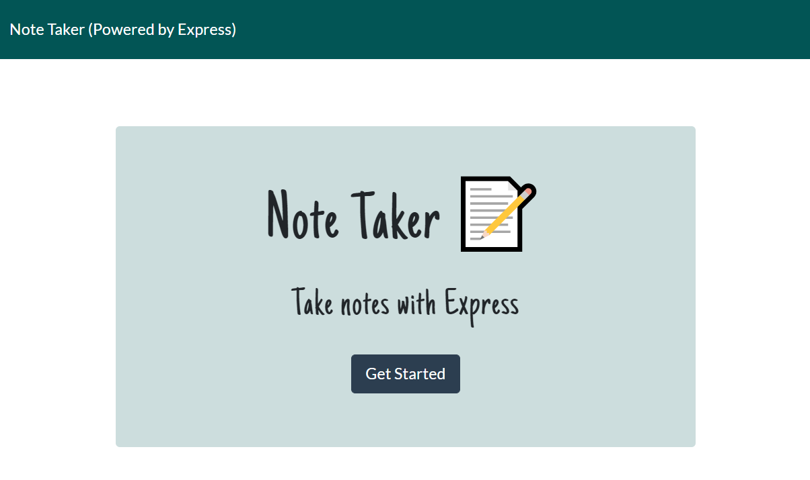
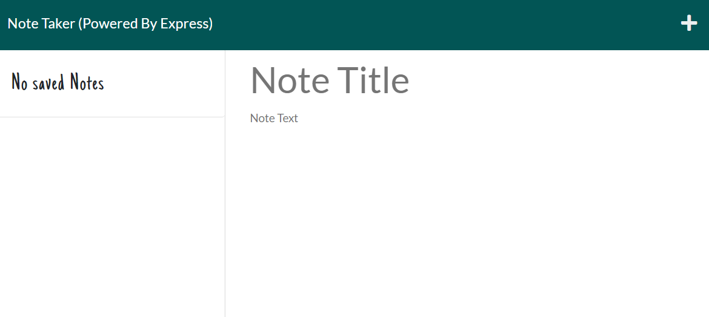
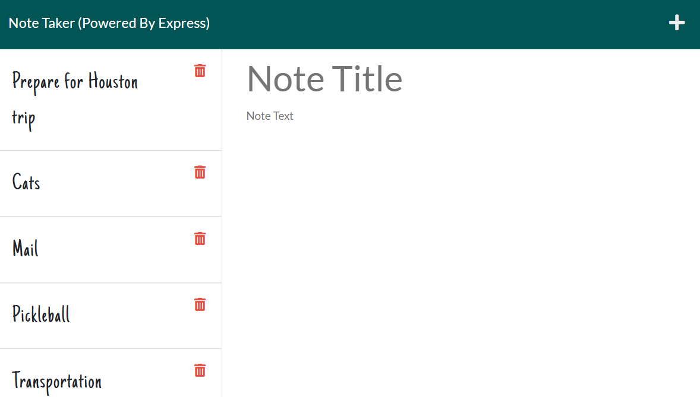

# NoteTaker-Powered-by-Express

## Author
- [@LindaWaterhouse](https://www.github.com/llwaterhouse)

## Description
* Note Taker has a simple graphical interface that anyone can use where they are to jot down reminders and then bring them up to read at a later time.

* When starting the application, the user is presented with a landing page that tells them the name of the app with a button that will bring them to the notes page.

* The first time the app is used, the left hand column will be empty.  After the user enters a Note Title and Note Text, a save icon appears and they can save their note. The title will be displayed in a list on the left hand side.

* When the user selects a saved Note, it appears in the main window.  There is a trashcan icon next to each note so the user may delete items if they want.

* If the user closes the app and then re-opens it later, all the saved notes are restored.

* The final app is deployed to Heroku.

## Screenshots

## Built With

* Express
* HTML
* CSS
* Javascript
* node.js
* fs
* path
* Heroku

## Installation Instructions

If you want to edit application you must have a Github account, download Visual Studio Code, install node.js, and inquirer 

[Create a Github account](https://github.com)

[Download Visual Studio](https://code.visualstudio.com/download/)

[Download node.js](https://nodejs.org/en/download/)

Clone the github project

To install packages dependencies in package.json, open a console in the top level directory and run the following command 

>npm install 

## Usage
To run this application, simply click on this link:

Then answer the questions at the command line interface.

## Deliverables

[Sample team.html file that is generated](output/team.html)

### Walkthrough video

The walkthrough video shows how all of the tests pass using the command:
>npm test

It then shows how the application is run and how the input is entered and creates an example team using the command:
>node index

and displays the final team.html file.
 
[Click here to watch Walkthrough Video](https://watch.screencastify.com/v/GnWDpSZOAfDbLp9Y2Bkf)

### Repository

[GitHub repository for this project](https://github.com/llwaterhouse/Easy-to-use-Team-Profile-Generator)

## Acknowledgements

Rutgers Coding Bootcamp

## License
MIT

[Click here for full license text](LICENSE)
